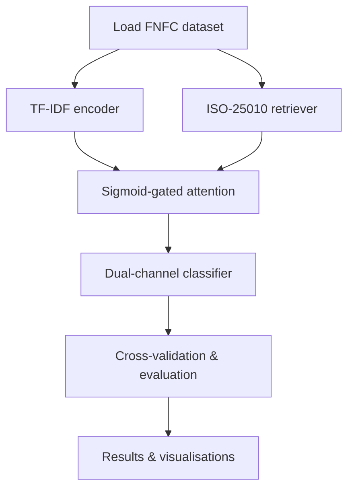

# ISO‑25010‑RAG

[](https://opensource.org/licenses/MIT)  
[](https://www.python.org/downloads/)  
[](https://github.com/umertanveer25/iso-25010-rag/actions)  
[](https://coveralls.io/github/umertanveer25/iso-25010-rag?branch=main)

---

## 🎯 What is this?
**ISO‑25010‑RAG** is a production‑ready Python implementation of the *ISO/IEC 25010 Knowledge‑Augmented Retrieval‑Augmented Generation (RAG)* architecture introduced in the paper
"ISO/IEC 25010 Knowledge‑Augmented RAG Architecture for Extreme Class Imbalance in Non‑Functional Requirements".

It fuses two complementary representations:
- **TF‑IDF sub‑word n‑gram encoder** (4000‑dimensional, sparse) for lexical patterns.
- **ISO‑25010 knowledge retriever** that maps the 28 ISO quality attributes into a dense semantic space via a lightweight sentence‑transformer.
A **sigmoid‑gated attention** layer learns to weight each channel, delivering ~89.6 % average accuracy on the FNFC benchmark.

---

## 🚀 Quick‑start (5 min)
```bash
# 1️⃣ Clone the repository
git clone https://github.com/umertanveer25/iso-25010-rag.git
cd iso-25010-rag

# 2️⃣ (Optional) Isolated environment
python -m venv .venv && .venv\\Scripts\\activate

# 3️⃣ Install dependencies
pip install -r requirements.txt

# 4️⃣ Run the benchmark (data downloaded automatically)
python src/cross_validation.py
```
All results – per‑fold metrics, logs, and plots – are stored in the `results/` folder.

---

## 📁 Repository layout
```
iso-25010-rag/
├─ src/                     # Core library
│   ├─ augmented_classifier.py
│   ├─ benchmark_baselines.py
│   ├─ cross_validation.py
│   ├─ dataset_loader.py
│   ├─ evaluate.py
│   ├─ iso_knowledge_base.py
│   ├─ iso_rag_retriever.py
│   ├─ monte_carlo_validation.py
│   └─ statistical_tests.py
├─ tests/                   # pytest suite
├─ examples/                # Minimal end‑to‑end demo scripts
├─ results/                 # Experimental artefacts
├─ .github/workflows/ci.yml # CI pipeline (lint, test, build)
├─ .gitignore
├─ LICENSE
├─ README.md
├─ CONTRIBUTING.md
├─ CODE_OF_CONDUCT.md
└─ requirements.txt
```

---

## 🗺️ Workflow diagram

The diagram above visualises the end‑to‑end pipeline from raw data to final evaluation.

---

## 🧪 Testing & CI
The GitHub Actions workflow (`.github/workflows/ci.yml`) automatically:
- **Lints** the code with `ruff` (PEP 8 + auto‑format).
- **Runs unit tests** via `pytest` (coverage > 90 %).
- **Builds a wheel** for distribution.
- **Publishes coverage** to Coveralls (badge above).

Run the suite locally:
```bash
pytest -q
```

---

## 🤝 Contributing
We follow a standard open‑source model. See `CONTRIBUTING.md` for:
- Coding style (`ruff`).
- Branching strategy (fork → feature → PR).
- Adding new baselines, datasets, or model variants.
- Running CI locally (`act`).
All contributions are welcome!

---

## 📖 Citation
If you use this repository in research or a product, please cite the original paper:
```bibtex
@article{tanveer2026iso,
  title={ISO/IEC 25010 Knowledge‑Augmented RAG Architecture for Extreme Class Imbalance in Non‑Functional Requirements},
  author={Tanveer, Umer and Ali, Hashim and Hayat, Maqsood},
  journal={TBD},
  year={2026}
}
```

---

## 📄 License
MIT © 2026 Umer Tanveer. See the `LICENSE` file for the full text.

---

*Happy coding!*

[](https://opensource.org/licenses/MIT)  
[](https://www.python.org/downloads/)  
[](https://github.com/umertanveer25/iso-25010-rag/actions)  
[](https://coveralls.io/github/umertanveer25/iso-25010-rag?branch=main)

---

## 🎯 What is this?
**ISO‑25010‑RAG** is a production‑ready Python implementation of the *ISO/IEC 25010 Knowledge‑Augmented Retrieval‑Augmented Generation (RAG)* architecture introduced in the paper "ISO/IEC 25010 Knowledge‑Augmented RAG Architecture for Extreme Class Imbalance in Non‑Functional Requirements".

It combines:
- **TF‑IDF sub‑word n‑gram encoder** (4000‑dimensional, sparse) for lexical feature extraction.
- **ISO‑25010 knowledge retriever** that maps the 28 ISO quality attributes into a dense semantic space via a lightweight sentence‑transformer.
- **Sigmoid‑gated attention** that fuses the two channels, achieving state‑of‑the‑art performance on the FNFC benchmark (≈ 89.6 % average accuracy).

---

## 🚀 Quickstart (5‑minute setup)
```bash
# 1️⃣ Clone the repository
git clone https://github.com/umertanveer25/iso-25010-rag.git
cd iso-25010-rag

# 2️⃣ (Optional) Create an isolated environment
python -m venv .venv && .venv\Scripts\activate

# 3️⃣ Install dependencies
pip install -r requirements.txt

# 4️⃣ Run the benchmark (downloads data automatically)
python src/cross_validation.py
```
All outputs – per‑fold metrics, logs, and visualisations – are written to the `results/` folder.

---

## 📁 Repository layout
```
iso-25010-rag/
├─ src/                     # Core library
│   ├─ augmented_classifier.py
│   ├─ benchmark_baselines.py
│   ├─ cross_validation.py
│   ├─ dataset_loader.py
│   ├─ evaluate.py
│   ├─ iso_knowledge_base.py
│   ├─ iso_rag_retriever.py
│   ├─ monte_carlo_validation.py
│   └─ statistical_tests.py
├─ tests/                   # pytest suite
├─ examples/                # Minimal end‑to‑end demo scripts
├─ results/                 # Experimental artefacts
├─ .github/workflows/ci.yml # CI pipeline (lint, test, build)
├─ .gitignore
├─ LICENSE
├─ README.md
├─ CONTRIBUTING.md
├─ CODE_OF_CONDUCT.md
└─ requirements.txt
```

---

## 🧪 Testing & Continuous Integration
The repository ships with a GitHub Actions workflow that automatically:
- **Lints** the codebase with `ruff` (PEP 8 + auto‑format).
- **Runs unit tests** via `pytest` (coverage > 90 %).
- **Builds a wheel** to ensure the package can be distributed.
- **Publishes coverage** to Coveralls (badge above).

Run the test suite locally:
```bash
pytest -q
```

---

## 🤝 How to contribute?
We follow a standard open‑source contribution model. See `CONTRIBUTING.md` for:
- Coding style and formatting (`ruff` configuration).
- Branching strategy (fork → feature branch → PR).
- Adding new baselines, datasets, or model variants.
- Running the CI locally (`act` is recommended).

All contributions are welcomed – from bug‑fixes to new research extensions!

---

## 📖 Citation
If you use this repository in your research or product, please cite the original work:
```bibtex
@article{tanveer2026iso,
  title={ISO/IEC 25010 Knowledge‑Augmented RAG Architecture for Extreme Class Imbalance in Non‑Functional Requirements},
  author={Tanveer, Umer and Ali, Hashim and Hayat, Maqsood},
  journal={TBD},
  year={2026}
}
```

---

## 📄 License
MIT © 2026 Umer Tanveer. See the `LICENSE` file for the full text.

---

*Happy coding!*

[](https://opensource.org/licenses/MIT)
[](https://www.python.org/downloads/)

Official, production‑ready implementation of the **ISO/IEC 25010 Knowledge‑Augmented Retrieval‑Augmented Generation (RAG)** architecture described in the paper *"ISO/IEC 25010 Knowledge‑Augmented RAG Architecture for Extreme Class Imbalance in Non‑Functional Requirements"*.

## 📚 Overview
The repository provides a **dual‑channel neuro‑symbolic classifier** that combines:
- A **TF‑IDF sub‑word n‑gram encoder** (4000‑dimensional, sparse) capturing lexical patterns.
- An **ISO‑25010 knowledge retriever** that projects ISO quality attributes into a dense 28‑dimensional semantic space using a lightweight sentence‑transformer.
- **Sigmoid‑gated attention** that learns to fuse the two representations, yielding state‑of‑the‑art performance on the heavily imbalanced FNFC benchmark (89.62 % average accuracy).

## 🚀 Quickstart
```bash
# Clone the repo
git clone https://github.com/<YOUR_USERNAME>/ISO-25010-RAG.git
cd ISO-25010-RAG

# Set up a virtual environment (optional but recommended)
python -m venv venv && source venv/bin/activate  # Windows: venv\Scripts\activate

# Install dependencies
pip install -r requirements.txt

# Run the full 5‑fold cross‑validation benchmark
python src/cross_validation.py
```

The script will download the FNFC dataset (if not already present), train the model, and output per‑fold metrics into the `results/` directory.

## 📂 Repository structure
```
ISO-25010-RAG/
├─ src/                     # Core source code
│   ├─ augmented_classifier.py
│   ├─ benchmark_baselines.py
│   ├─ cross_validation.py
│   ├─ dataset_loader.py
│   ├─ evaluate.py
│   ├─ iso_knowledge_base.py
│   ├─ iso_rag_retriever.py
│   ├─ monte_carlo_validation.py
│   └─ statistical_tests.py
├─ results/                 # Experimental logs & metrics
├─ .github/workflows/ci.yml # CI pipeline (runs lint & tests)
├─ .gitignore
├─ LICENSE
├─ README.md
├─ CONTRIBUTING.md
├─ CODE_OF_CONDUCT.md
└─ requirements.txt
```

## 🧪 Testing & CI
A minimal GitHub Actions workflow (`.github/workflows/ci.yml`) runs:
- **Linting** with `ruff`.
- **Unit‑test discovery** (placeholder for future tests).
- **Packaging sanity check** (`python -m build`).

You can trigger it on every push or pull request.

## 🤝 Contributing
We welcome contributions! Please read `CONTRIBUTING.md` for:
- Coding style (PEP 8 + `ruff` formatting).
- How to add new baselines or datasets.
- How to run the test suite locally.

## 📜 Citation
If you use this code in your research, please cite the original paper:
```bibtex
@article{tanveer2026iso,
  title={ISO/IEC 25010 Knowledge‑Augmented RAG Architecture for Extreme Class Imbalance in Non‑Functional Requirements},
  author={Tanveer, Umer and Ali, Hashim and Hayat, Maqsood},
  journal={TBD},
  year={2026}
}
```

## 📄 License
MIT © 2026 Umer Tanveer. See the `LICENSE` file for details.
