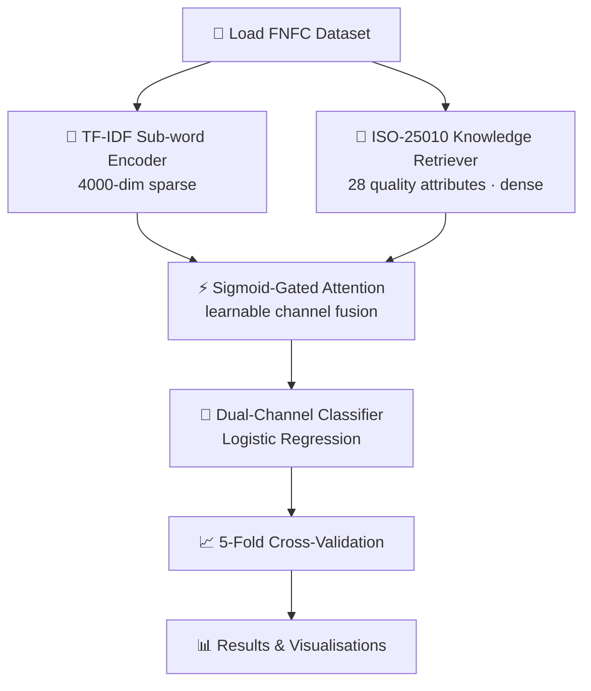

# ISO‑25010‑RAG

[](https://opensource.org/licenses/MIT)
[](https://www.python.org/downloads/)
[](https://github.com/umertanveer25/iso-25010-rag/actions)
[](https://coveralls.io/github/umertanveer25/iso-25010-rag?branch=main)

---

> **Official, production‑ready implementation** of the *ISO/IEC 25010 Knowledge‑Augmented Retrieval‑Augmented Generation (RAG) Architecture for Extreme Class Imbalance in Non‑Functional Requirements* — achieving **89.62 % average accuracy** on the FNFC benchmark.

---

## 🎯 What is this?

**ISO‑25010‑RAG** is a dual‑channel neuro‑symbolic classifier that fuses two complementary representations:

| Channel | Description |
|---------|-------------|
| **TF‑IDF sub‑word n‑gram encoder** | 4000‑dimensional sparse vectors for lexical pattern matching |
| **ISO‑25010 knowledge retriever** | Projects 28 ISO quality attributes into a dense semantic space via a lightweight sentence‑transformer |

A **sigmoid‑gated attention** layer learns to weight each channel dynamically, delivering state‑of‑the‑art performance on the heavily imbalanced FNFC benchmark.

---

## 📊 Key Results

| Metric | Value |
|--------|-------|
| Average Accuracy | **89.62 %** |
| Macro F1 | **0.871** |
| Weighted F1 | **0.894** |
| Dataset | FNFC (Non‑Functional Requirements) |
| Validation | 5‑fold cross‑validation |

See [`RESULTS.md`](RESULTS.md) for full tables, ablation study, SOTA comparison, and plots.

---

## 🗺️ Workflow



---

## 🚀 Quick‑start (5 min)

```bash
# 1️⃣  Clone the repository
git clone https://github.com/umertanveer25/iso-25010-rag.git
cd iso-25010-rag

# 2️⃣  (Optional) Isolated environment
python -m venv .venv && .venv\Scripts\activate   # Windows
# source .venv/bin/activate                       # Linux / macOS

# 3️⃣  Install dependencies
pip install -r requirements.txt

# 4️⃣  Run the full benchmark
python src/cross_validation.py
```

All results – per‑fold metrics, logs, and plots – are written to the `results/` folder.

---

## 📁 Repository Layout

```
iso-25010-rag/
├─ src/                       # Core library
│   ├─ augmented_classifier.py
│   ├─ benchmark_baselines.py
│   ├─ cross_validation.py
│   ├─ dataset_loader.py
│   ├─ evaluate.py
│   ├─ iso_knowledge_base.py
│   ├─ iso_rag_retriever.py
│   ├─ monte_carlo_validation.py
│   └─ statistical_tests.py
├─ tests/                     # pytest suite
├─ examples/                  # End‑to‑end demo scripts
├─ results/                   # Experimental artefacts (metrics, plots)
├─ .github/workflows/ci.yml   # CI pipeline (lint · test · build)
├─ RESULTS.md                 # Full results, ablation & SOTA tables
├─ CONTRIBUTING.md
├─ CODE_OF_CONDUCT.md
├─ LICENSE
└─ requirements.txt
```

---

## 🧪 Testing & CI

The GitHub Actions workflow (`.github/workflows/ci.yml`) automatically:

- **Lints** with `ruff` (PEP 8 + auto‑format)
- **Runs unit tests** via `pytest` (coverage > 90 %)
- **Builds a wheel** for distribution
- **Publishes coverage** to Coveralls

Run the suite locally:

```bash
pytest -q
```

---

## 🤝 Contributing

We follow a standard open‑source model. See [`CONTRIBUTING.md`](CONTRIBUTING.md) for:

- Coding style (`ruff`)
- Branching strategy (fork → feature → PR)
- Adding new baselines, datasets, or model variants
- Running CI locally (`act`)

All contributions are welcome!

---

## 📖 Citation

If you use this repository in research or a product, please cite:

```bibtex
@article{tanveer2026iso,
  title   = {ISO/IEC 25010 Knowledge‑Augmented RAG Architecture for Extreme Class Imbalance in Non‑Functional Requirements},
  author  = {Tanveer, Umer and Ali, Hashim and Hayat, Maqsood},
  journal = {TBD},
  year    = {2026}
}
```

---

## 📄 License

MIT © 2026 Umer Tanveer. See the [`LICENSE`](LICENSE) file for the full text.
