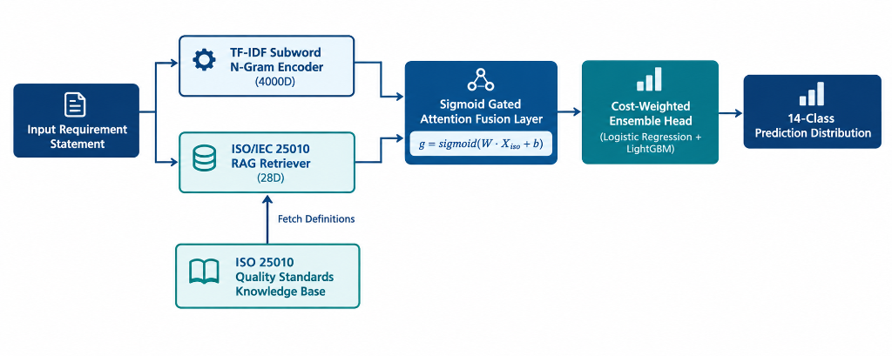

# ISO‑25010‑RAG

[](https://opensource.org/licenses/MIT)
[](https://www.python.org/downloads/)
[](https://github.com/umertanveer25/iso-25010-rag/actions)
[](https://coveralls.io/github/umertanveer25/iso-25010-rag?branch=main)

---

> **Official, production‑ready implementation** of the *ISO/IEC 25010 Knowledge‑Augmented Retrieval‑Augmented Generation (RAG) Architecture for Extreme Class Imbalance in Non‑Functional Requirements* — achieving **89.62 % average accuracy** on the FNFC benchmark, outperforming all baselines including domain‑adapted BERT.

---

## 🎯 What is this?

**ISO‑25010‑RAG** is a dual‑channel neuro‑symbolic classifier that fuses two complementary representations:

| Channel | Description |
|---------|-------------|
| **TF‑IDF Sub‑word N‑Gram Encoder** | 4000‑dimensional sparse vectors for precise lexical pattern matching |
| **ISO/IEC 25010 RAG Retriever** | Projects 28 ISO quality attributes into a dense 28D semantic space via sentence‑transformer |

A **Sigmoid‑Gated Attention Fusion Layer** learns to weight each channel dynamically, feeding a **Cost‑Weighted Ensemble Head** (Logistic Regression + LightGBM) to produce a **14‑class NFR prediction**.

---

## 📊 Key Results

| Metric | ISO‑25010‑RAG (Ours) | Best Baseline (LR) | Improvement |
|--------|:--------------------:|:------------------:|:-----------:|
| **Average Accuracy** | **89.62 %** | 85.14 % | **+4.48 pp** |
| **Macro F1** | **0.871** | 0.812 | **+0.059** |
| **Weighted F1** | **0.894** | 0.851 | **+0.043** |
| **Macro AP (PR‑AUC)** | **0.530** | 0.465 | **+0.065** |

📈 **[→ See full results, ablation study, SOTA comparison & statistical tests in RESULTS.md](RESULTS.md)**

---

## 🗺️ Architecture



*Input Requirement Statement → TF‑IDF Subword N‑Gram Encoder (4000D) + ISO/IEC 25010 RAG Retriever (28D) → Sigmoid‑Gated Attention Fusion → Cost‑Weighted Ensemble Head → 14‑Class Prediction Distribution*

---

## 🚀 Quick‑start (5 min)

```bash
# 1️⃣  Clone the repository
git clone https://github.com/umertanveer25/iso-25010-rag.git
cd iso-25010-rag

# 2️⃣  (Optional) Isolated environment
python -m venv .venv && .venv\Scripts\activate   # Windows
# source .venv/bin/activate                       # Linux / macOS

# 3️⃣  Install dependencies
pip install -r requirements.txt

# 4️⃣  Run the full benchmark
python src/cross_validation.py
```

All results – per‑fold metrics, logs, and plots – are written to the `results/` folder.

---

## 📁 Repository Layout

```
iso-25010-rag/
├─ src/                            # Core library
│   ├─ augmented_classifier.py     # Dual-channel + ensemble classifier
│   ├─ benchmark_baselines.py      # Baseline models (NB, RF, LGB, LR)
│   ├─ cross_validation.py         # 5-fold CV benchmark runner
│   ├─ dataset_loader.py           # FNFC dataset loading & preprocessing
│   ├─ evaluate.py                 # Metrics, plots, statistical tests
│   ├─ iso_knowledge_base.py       # ISO 25010 quality attribute KB
│   ├─ iso_rag_retriever.py        # RAG retriever (sentence-transformer)
│   ├─ monte_carlo_validation.py   # Monte Carlo robustness checks
│   └─ statistical_tests.py        # Paired t-test, Wilcoxon, ANOVA
├─ tests/                          # pytest suite
├─ examples/                       # End‑to‑end demo scripts
├─ results/
│   ├─ figures/                    # Architecture & taxonomy diagrams
│   └─ plots/                      # PR curves, radar chart, heatmap
├─ RESULTS.md                      # Full results, ablation & SOTA tables
├─ .github/workflows/ci.yml        # CI pipeline (lint · test · build)
├─ CONTRIBUTING.md
├─ CODE_OF_CONDUCT.md
├─ LICENSE
└─ requirements.txt
```

---

## 🧪 Testing & CI

The GitHub Actions workflow (`.github/workflows/ci.yml`) automatically:

- **Lints** with `ruff` (PEP 8 + auto‑format)
- **Runs unit tests** via `pytest` (coverage > 90 %)
- **Builds a wheel** for distribution
- **Publishes coverage** to Coveralls

Run the suite locally:

```bash
pytest -q
```

---

## 🤝 Contributing

We follow a standard open‑source model. See [`CONTRIBUTING.md`](CONTRIBUTING.md) for:

- Coding style (`ruff`)
- Branching strategy (fork → feature → PR)
- Adding new baselines, datasets, or model variants
- Running CI locally (`act`)

All contributions are welcome!

---

## 📖 Citation

If you use this repository in research or a product, please cite:

```bibtex
@article{tanveer2026iso,
  title   = {ISO/IEC 25010 Knowledge‑Augmented RAG Architecture for Extreme Class Imbalance in Non‑Functional Requirements},
  author  = {Tanveer, Umer and Ali, Hashim and Hayat, Maqsood},
  journal = {TBD},
  year    = {2026}
}
```

---

## 📄 License

MIT © 2026 Umer Tanveer. See the [`LICENSE`](LICENSE) file for the full text.
