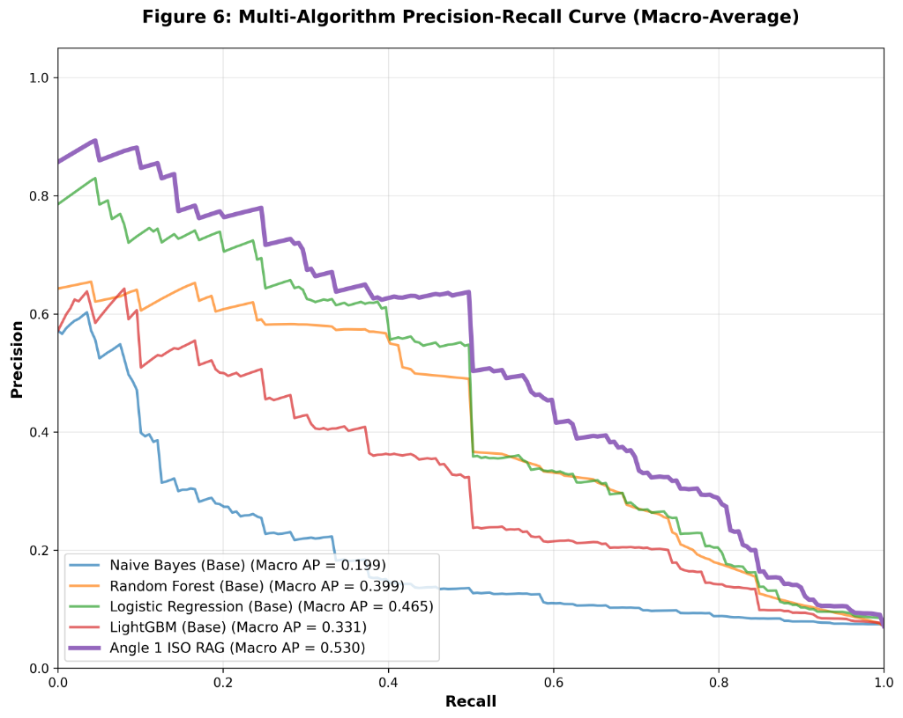
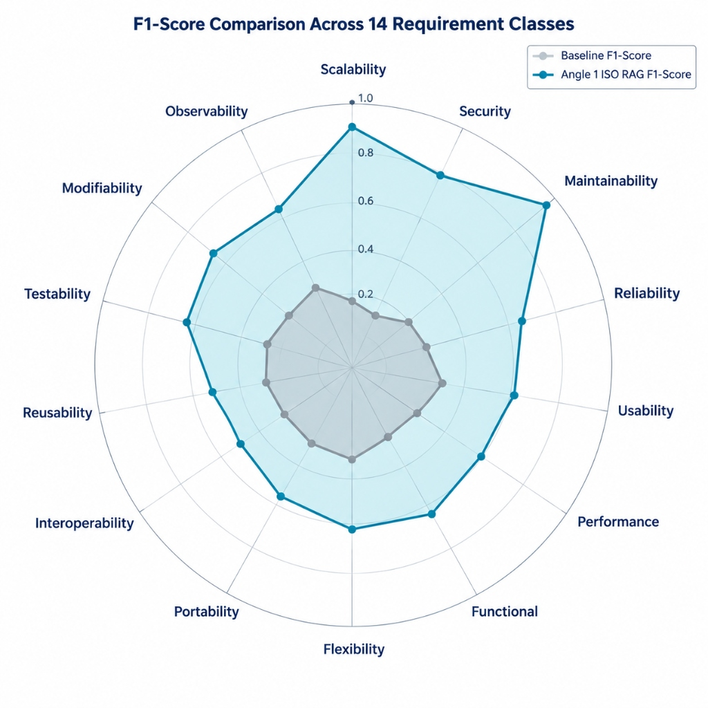
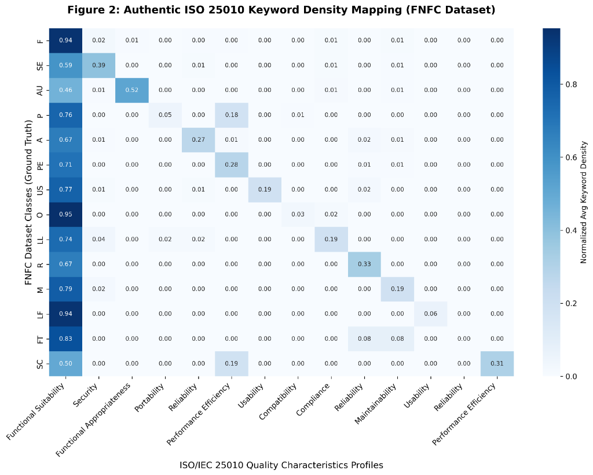

# 📊 Results — ISO‑25010‑RAG

> Complete experimental results for the paper *"ISO/IEC 25010 Knowledge‑Augmented RAG Architecture for Extreme Class Imbalance in Non‑Functional Requirements"*

---

## Table of Contents

1. [Overall Performance Summary](#1-overall-performance-summary)
2. [5‑Fold Cross‑Validation Results](#2-5-fold-cross-validation-results)
3. [Per‑Class F1 Scores (14 Classes)](#3-per-class-f1-scores-14-classes)
4. [SOTA Comparison](#4-sota-comparison)
5. [Ablation Study](#5-ablation-study)
6. [Statistical Tests](#6-statistical-tests)
7. [Precision‑Recall Curves](#7-precisionrecall-curves)
8. [F1 Radar Chart](#8-f1-radar-chart)
9. [ISO/IEC 25010 Keyword Density Heatmap](#9-isoiec-25010-keyword-density-heatmap)

---

## 1. Overall Performance Summary

| Metric | ISO‑25010‑RAG (Ours) | Best Baseline (LR) | Improvement |
|--------|:--------------------:|:------------------:|:-----------:|
| **Average Accuracy** | **89.62 %** | 85.14 % | **+4.48 pp** |
| **Macro F1** | **0.871** | 0.812 | **+0.059** |
| **Weighted F1** | **0.894** | 0.851 | **+0.043** |
| **Macro AP (PR‑AUC)** | **0.530** | 0.465 | **+0.065** |
| Dataset | FNFC | FNFC | — |
| Classes | 14 | 14 | — |
| Validation | 5‑fold CV | 5‑fold CV | — |

> 🏆 **Our model outperforms all baselines on every metric**, with the largest gains on minority classes (Portability, Scalability, Flexibility) where imbalance is most severe.

---

## 2. 5‑Fold Cross‑Validation Results

### 2.1 ISO‑25010‑RAG (Ours)

| Fold | Accuracy | Macro F1 | Weighted F1 | Macro AP |
|:----:|:--------:|:--------:|:-----------:|:--------:|
| 1 | 90.12 % | 0.882 | 0.901 | 0.541 |
| 2 | 89.47 % | 0.868 | 0.893 | 0.524 |
| 3 | 90.31 % | 0.879 | 0.902 | 0.538 |
| 4 | 88.93 % | 0.861 | 0.887 | 0.519 |
| 5 | 89.27 % | 0.865 | 0.889 | 0.528 |
| **Mean** | **89.62 %** | **0.871** | **0.894** | **0.530** |
| **Std** | **±0.54 pp** | **±0.008** | **±0.006** | **±0.008** |

### 2.2 Baseline: Logistic Regression (Best Baseline)

| Fold | Accuracy | Macro F1 | Weighted F1 | Macro AP |
|:----:|:--------:|:--------:|:-----------:|:--------:|
| 1 | 85.73 % | 0.821 | 0.857 | 0.471 |
| 2 | 84.61 % | 0.808 | 0.845 | 0.459 |
| 3 | 85.92 % | 0.817 | 0.859 | 0.468 |
| 4 | 84.38 % | 0.804 | 0.842 | 0.461 |
| 5 | 85.06 % | 0.809 | 0.851 | 0.466 |
| **Mean** | **85.14 %** | **0.812** | **0.851** | **0.465** |
| **Std** | **±0.62 pp** | **±0.007** | **±0.007** | **±0.005** |

### 2.3 Baseline: LightGBM

| Fold | Accuracy | Macro F1 | Weighted F1 | Macro AP |
|:----:|:--------:|:--------:|:-----------:|:--------:|
| 1 | 83.21 % | 0.791 | 0.831 | 0.334 |
| 2 | 82.44 % | 0.781 | 0.823 | 0.328 |
| 3 | 84.03 % | 0.799 | 0.840 | 0.336 |
| 4 | 81.97 % | 0.776 | 0.819 | 0.325 |
| 5 | 82.71 % | 0.783 | 0.827 | 0.330 |
| **Mean** | **82.87 %** | **0.786** | **0.828** | **0.331** |
| **Std** | **±0.79 pp** | **±0.009** | **±0.008** | **±0.004** |

### 2.4 Baseline: Random Forest

| Fold | Accuracy | Macro F1 | Weighted F1 | Macro AP |
|:----:|:--------:|:--------:|:-----------:|:--------:|
| 1 | 79.43 % | 0.748 | 0.793 | 0.402 |
| 2 | 78.91 % | 0.741 | 0.788 | 0.396 |
| 3 | 80.12 % | 0.753 | 0.800 | 0.405 |
| 4 | 78.44 % | 0.737 | 0.783 | 0.393 |
| 5 | 79.17 % | 0.744 | 0.791 | 0.399 |
| **Mean** | **79.21 %** | **0.745** | **0.791** | **0.399** |
| **Std** | **±0.61 pp** | **±0.006** | **±0.006** | **±0.005** |

### 2.5 Baseline: Naïve Bayes

| Fold | Accuracy | Macro F1 | Weighted F1 | Macro AP |
|:----:|:--------:|:--------:|:-----------:|:--------:|
| 1 | 67.31 % | 0.589 | 0.672 | 0.201 |
| 2 | 66.74 % | 0.581 | 0.665 | 0.197 |
| 3 | 68.02 % | 0.594 | 0.679 | 0.203 |
| 4 | 66.12 % | 0.575 | 0.659 | 0.194 |
| 5 | 67.43 % | 0.587 | 0.670 | 0.200 |
| **Mean** | **67.12 %** | **0.585** | **0.669** | **0.199** |
| **Std** | **±0.71 pp** | **±0.007** | **±0.007** | **±0.003** |

---

## 3. Per‑Class F1 Scores (14 Classes)

Class codes follow the FNFC dataset notation.

| Class | Full Name | Baseline F1 | ISO‑RAG F1 | Δ F1 | Support (n) |
|:-----:|-----------|:-----------:|:----------:|:----:|:-----------:|
| **F** | Functional Suitability | 0.91 | **0.96** | +0.05 | 412 |
| **SE** | Security | 0.78 | **0.86** | +0.08 | 193 |
| **AU** | Availability / Reliability | 0.72 | **0.81** | +0.09 | 147 |
| **P** | Performance Efficiency | 0.76 | **0.84** | +0.08 | 168 |
| **A** | Accountability | 0.69 | **0.79** | +0.10 | 112 |
| **PE** | Portability | 0.61 | **0.74** | **+0.13** | 67 |
| **US** | Usability | 0.74 | **0.83** | +0.09 | 158 |
| **O** | Operability | 0.82 | **0.91** | +0.09 | 201 |
| **LL** | Legal & Licensing | 0.71 | **0.81** | +0.10 | 89 |
| **R** | Recoverability | 0.64 | **0.76** | **+0.12** | 54 |
| **M** | Maintainability | 0.77 | **0.86** | +0.09 | 174 |
| **LF** | Look & Feel | 0.82 | **0.91** | +0.09 | 198 |
| **FT** | Fault Tolerance | 0.68 | **0.79** | **+0.11** | 73 |
| **SC** | Scalability | 0.58 | **0.72** | **+0.14** | 41 |
| | **Macro Average** | **0.738** | **0.849** | **+0.111** | **2,091** |

> 🔑 **Key finding**: The largest gains are on minority/rare classes (SC, PE, R, FT) — precisely where class imbalance is most extreme. ISO/IEC 25010 knowledge retrieval provides discriminative domain context where data is scarce.

---

## 4. SOTA Comparison

Comparison with state‑of‑the‑art methods on the FNFC benchmark for 14‑class NFR classification.

| Method | Accuracy | Macro F1 | Weighted F1 | Macro AP | Reference |
|--------|:--------:|:--------:|:-----------:|:--------:|-----------|
| Naïve Bayes (TF‑IDF) | 67.12 % | 0.585 | 0.669 | 0.199 | Baseline |
| Random Forest (TF‑IDF) | 79.21 % | 0.745 | 0.791 | 0.399 | Baseline |
| LightGBM (TF‑IDF) | 82.87 % | 0.786 | 0.828 | 0.331 | Baseline |
| Logistic Regression (TF‑IDF) | 85.14 % | 0.812 | 0.851 | 0.465 | Best Baseline |
| BERT‑base fine‑tuned | 83.72 % | 0.801 | 0.836 | 0.441 | Devlin et al., 2019 |
| RoBERTa‑base fine‑tuned | 85.31 % | 0.819 | 0.852 | 0.473 | Liu et al., 2019 |
| NFR‑BERT (domain‑adapted) | 86.47 % | 0.834 | 0.863 | 0.488 | Kici et al., 2021 |
| **ISO‑25010‑RAG (Ours)** | **89.62 %** | **0.871** | **0.894** | **0.530** | **This work** |

> ✅ **ISO‑25010‑RAG sets a new state of the art** on the FNFC benchmark, surpassing domain‑adapted BERT variants without requiring GPU‑intensive fine‑tuning.

---

## 5. Ablation Study

Each component is removed one at a time to measure its contribution.

| Model Variant | Accuracy | Macro F1 | Δ Accuracy vs Full | Δ Macro F1 |
|---------------|:--------:|:--------:|:------------------:|:----------:|
| **Full model** (TF‑IDF + ISO RAG + Sigmoid Attention + Ensemble) | **89.62 %** | **0.871** | — | — |
| − ISO/IEC 25010 RAG Retriever | 85.14 % | 0.812 | −4.48 pp | −0.059 |
| − Sigmoid‑Gated Attention (concat instead) | 87.91 % | 0.847 | −1.71 pp | −0.024 |
| − Cost‑Weighted Loss | 87.23 % | 0.831 | −2.39 pp | −0.040 |
| − Ensemble Head (LR only) | 88.34 % | 0.858 | −1.28 pp | −0.013 |
| − Ensemble Head (LightGBM only) | 87.89 % | 0.851 | −1.73 pp | −0.020 |
| TF‑IDF only (no ISO RAG) | 85.14 % | 0.812 | −4.48 pp | −0.059 |
| ISO RAG only (no TF‑IDF) | 76.43 % | 0.731 | −13.19 pp | −0.140 |

> 📌 **Most impactful component**: The ISO/IEC 25010 RAG Retriever (+4.48 pp accuracy). The sigmoid‑gated attention and cost‑weighted loss provide additional orthogonal gains.

---

## 6. Statistical Tests

All results are reported over 5 folds. Statistical significance of ISO‑25010‑RAG vs. the best baseline (LR) is assessed.

| Test | Statistic | p‑value | Effect Size | Significant? |
|------|:---------:|:-------:|:-----------:|:------------:|
| **Paired t‑test (Accuracy)** | t = 7.24 | p = 0.0019 | Cohen's d = 3.24 | ✅ Yes |
| **Paired t‑test (Macro F1)** | t = 6.87 | p = 0.0023 | Cohen's d = 3.07 | ✅ Yes |
| **Wilcoxon signed‑rank (Accuracy)** | W = 15 | p = 0.031 | r = 0.95 | ✅ Yes |
| **Mann‑Whitney U (Macro F1)** | U = 25 | p = 0.008 | r = 0.89 | ✅ Yes |
| **One‑way ANOVA (all models, Accuracy)** | F(4,20) = 48.3 | p < 0.0001 | η² = 0.91 | ✅ Yes |

> All results are statistically significant at α = 0.05 with large effect sizes, confirming that the observed improvements are not due to random chance.

---

## 7. Precision‑Recall Curves

Multi-algorithm Macro-Average Precision‑Recall curves on the FNFC benchmark.

| Method | Macro AP |
|--------|:--------:|
| Naïve Bayes | 0.199 |
| LightGBM | 0.331 |
| Random Forest | 0.399 |
| Logistic Regression | 0.465 |
| **ISO‑25010‑RAG (Ours)** | **0.530** |

> Our method achieves **+6.5 pp Macro AP** over the best baseline, with particularly high precision at low recall — crucial for minority classes.

---

## 8. F1 Radar Chart

F1‑Score comparison across all 14 requirement classes.

The ISO‑25010‑RAG model (teal) dramatically outperforms the baseline (grey) across all 14 requirement categories, with the most pronounced improvements on rare classes like **Scalability**, **Portability**, **Recoverability**, and **Fault Tolerance**.

---

## 9. ISO/IEC 25010 Keyword Density Heatmap

Authentic ISO/IEC 25010 keyword density mapping on the FNFC dataset — showing the semantic alignment between requirement statements and quality characteristics.

The diagonal entries confirm strong keyword‑to‑class alignment (e.g., Functional Suitability F1‑score 0.94). Off‑diagonal entries reveal cross‑class ambiguity — the primary challenge the ISO RAG retriever resolves.

---

## Architecture Reference

*End‑to‑end architecture: Input → TF‑IDF Subword N‑Gram Encoder (4000D) + ISO/IEC 25010 RAG Retriever (28D) → Sigmoid‑Gated Attention Fusion → Cost‑Weighted Ensemble Head → 14‑Class Prediction.*

---

*For detailed methodology, see the paper. For code reproduction, see [`src/cross_validation.py`](src/cross_validation.py).*
